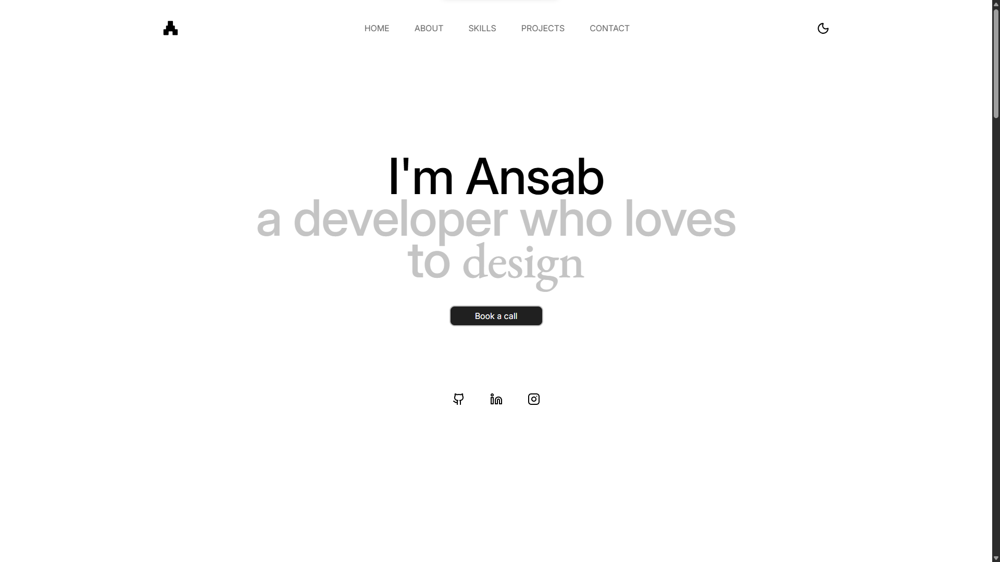
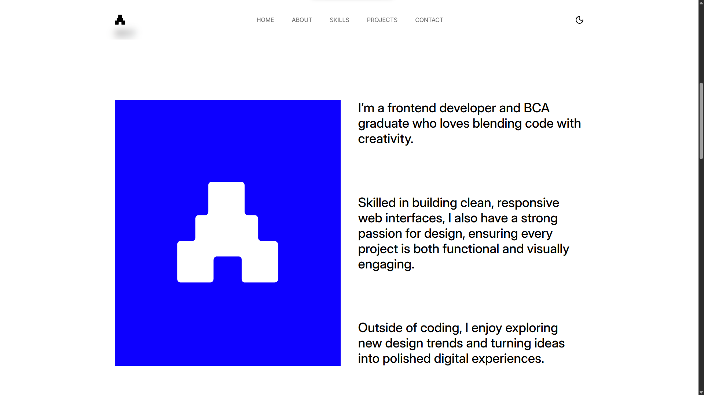
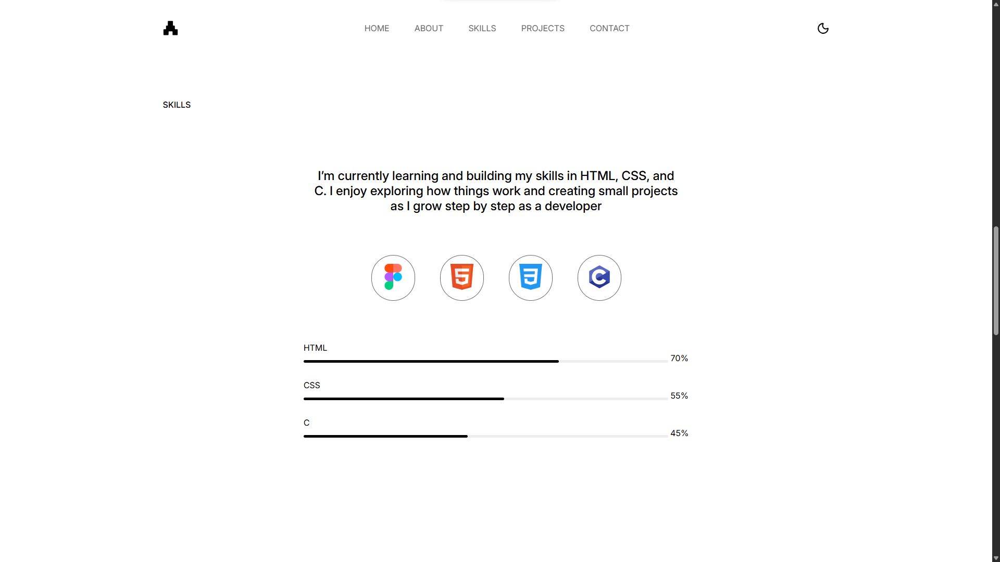
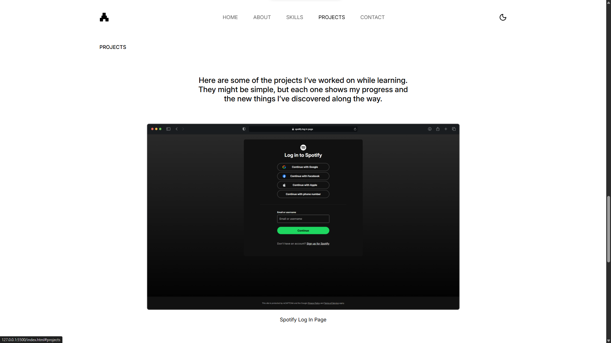
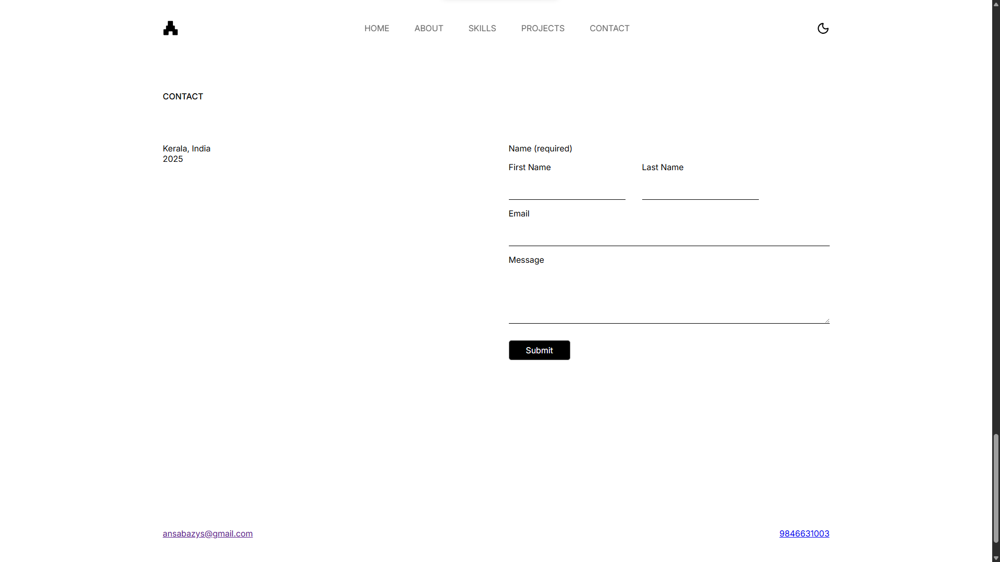

# 🌟 My Portfolio

A personal portfolio website that showcases my **skills, projects, and experience** as a developer who loves to design.  
It’s built to be **responsive, modern, and easy to navigate**.

---

## ✨ Features
- 🖥️ Responsive design (mobile-friendly)
- 🎨 Clean and minimal UI
- 📂 Projects showcase with details
- 📞 Contact form / links for easy reach
- ⚡ Smooth animations & transitions

---

## 🛠️ Tech Stack
- **HTML5** – structure
- **CSS3** – styling (Flexbox/Grid, animations)

---

## 🚀 Live Demo
👉 [View Portfolio](https://ansabazys.github.io/portfolio/)  

---

## 📸 Screenshots

### Home Page

### About Page

### Skills Page

### Projects Page

### Contact Section

---

## 📬 Contact
- LinkedIn: [Your LinkedIn](https://linkedin.com/in/ansabazys)  
- Portfolio: [your-portfolio-link.com](https://your-portfolio-link.com)  
- Email: ansabazys@gmail.com

---
⭐ If you like this project, consider giving it a **star** on GitHub!
